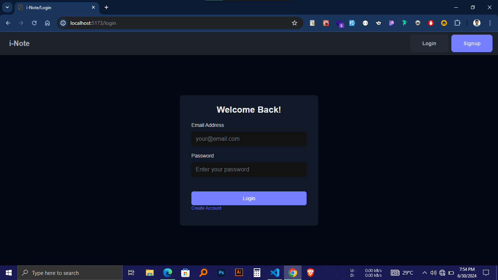

# Hi There 👋

## Wellcome to project i-Note
## If you like the project please give this repo a star⭐
### Description : This is simple Note Application where you can Add note delete note edit note with complete login system and user management
## A demo is better than thousand word give it a try

# Demo
# [project-i-note.onrender.com](https://project-i-note.onrender.com "i-Note")

## Thech Stack
- ## Mongo DB For database
- ## Express Js For backend
- ## React For Frontend
- ## Node Js 
## To Run this Aplication localy on your computer follow those steps :
## Frist clone this repo by pasting this command on your turminal
```bash
https://github.com/yeasinarafat1/Project-i-Note.git
```
### create a .env file and fill with these value 
```js
PORT=5000
DB_URI=mongodb://localhost:27017/iNote
JWT_SCRET=jfweffjfjgjgrgegjejgirepeirge
```
### On the root of the directory run this command 
```bash
npm install && npm install --prefix frontend
```
### On the Root of Directory run this command
```
npm run dev
```
### Open another turminal and run 
```
cd Frontend && npm run dev
```
### After completing all these steps open http://localhost:5173 you should see these window
[]
## Now enjoy customize it and make it yours
# Thanks for visiting 
